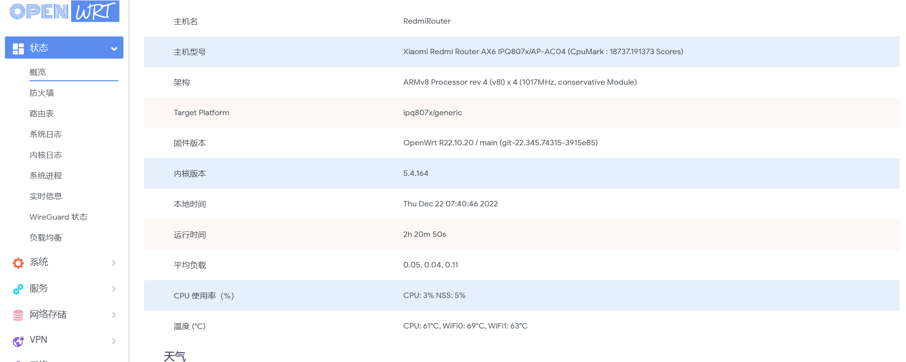
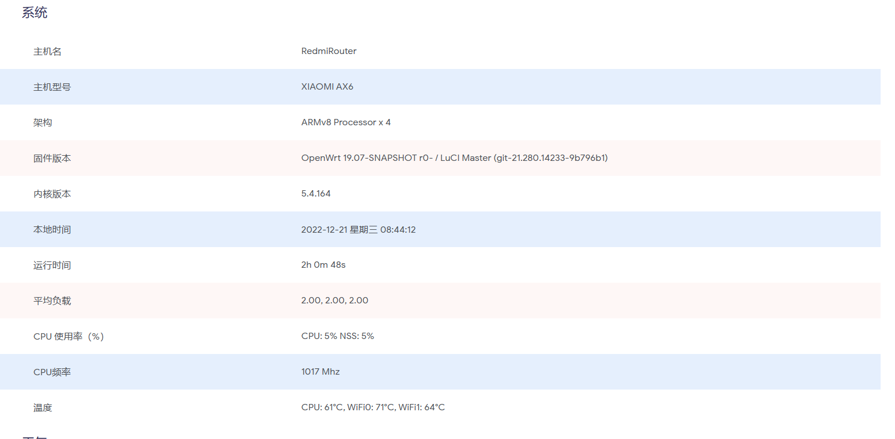

# 一些个人DIY补丁分享
## 这是针对目前网上能找到的固件的不满意部分细微修改，你可以直接抄我的作业，目前包括
* 给没有温度条的大雕QSDK和开源添加温度条，和显示调度类型（已在AX6上测试）
  *[]
* 给志平QSDK固件添加网口状态（已在AX6上测试）
  *[]
## 当然了，你也可以自己DIY你的OpenWrt，不过你可能能需要一定HTML5和OP基础
* 没有基础的，且对OPENWRT感兴趣，立即报名学习OPENWRT开发，戳这里（外链@佐须之男）👉https://forgotfun.org/openwrt-training.html
  * 想学习 OpenWrt 开发，但是摸不着门道？自学没毅力？基础太差？怕太难学不会？跟着佐大学 OpenWrt 开发入门培训班助你能学有所成
* 已有开发基础？想为国内OPNEWRT开发添砖加瓦？LEDE项目欢迎您，戳这里（外链@大雕）👉https://github.com/coolsnowwolf/lede
   * 欢迎来到 Lean 的 LEDE 源码仓库
